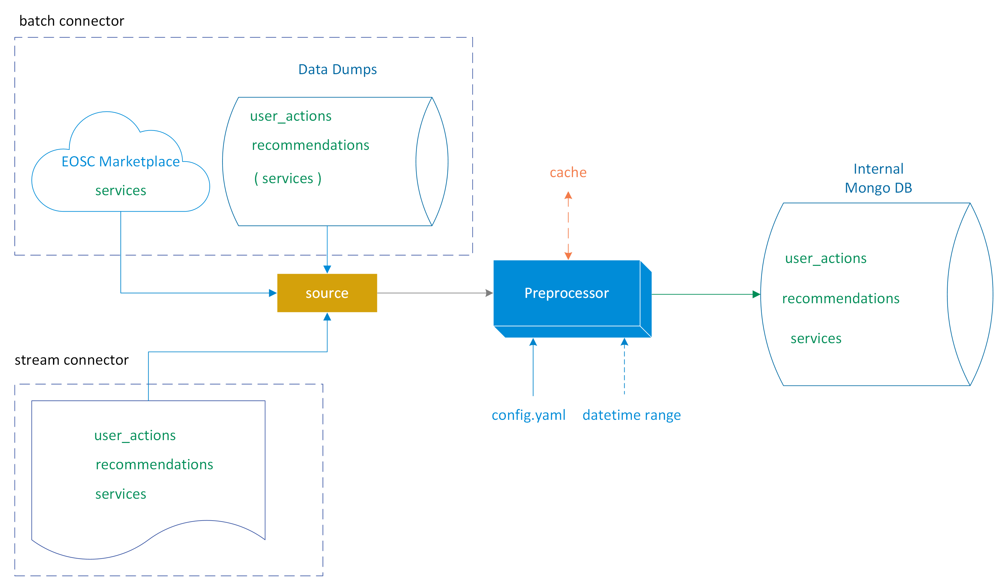
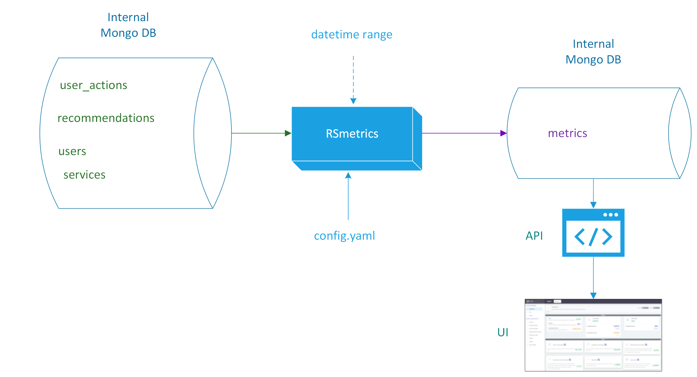

# Recommender Metrics Framework
A framework for generating statistics, metrics, KPIs, and graphs for Recommender Systems
<a href="https://eu.badgr.com/public/assertions/YWmU9yPvQxumUgd1vnPPSw">

</a>

<p align="center">
<a href="https://github.com/ARGOeu/eosc-recommender-metrics/blob/ec222c3090892f33056086b8d30c18f713da519d/website/docs/static/img/flow.png">

</a>
</p>


## Preprocessor

<p align="center">
<a href="https://github.com/ARGOeu/eosc-recommender-metrics/blob/ec222c3090892f33056086b8d30c18f713da519d/website/docs/static/img/preprocessor.png">

</a>
</p>

## RS metrics

<p align="center">
<a href="https://github.com/ARGOeu/eosc-recommender-metrics/blob/ec222c3090892f33056086b8d30c18f713da519d/website/docs/static/img/rsmetrics.png">

</a>
</p>

## Dependencies

1. Install Conda from [here](https://docs.conda.io/projects/conda/en/latest/user-guide/install/linux.html). Tested on conda v 4.10.3.
2. Run from terminal: `conda env create -f environment.yml`
3. Run from terminal: `conda activate rsmetrics`
4. Run from terminal: `chmod +x ./preprocessor.py ./preprocessor_common.py ./rsmetrics.py`

## Usage

### Usage of the Batch System
5. Configure `./preprocessor_common.py`, `./preprocessor.py` and `./rsmetrics.py` by editting the `config.yaml` or providing another with `-c`.
6. Run from terminal: `./preprocessor_common.py` in order to gather `users` and `resources` and store them in the `Datastore`:
```bash
./preprocessor_common.py # this will ingest users and resources [from scratch] by retrieving the data from 'marketplace_rs' provider (which is specified in the config file
./preprocessor_common.py -p marketplace_rs # equivalent to first one
./preprocessor_common.py -p marketplace_rs --use-cache # equivalent to first one but use the cache file to read resources instead of downloading them via the EOSC Marketplace
./preprocessor_common.py -p athena # currently is not working since users collection only exist in 'marketplace_rs'
```
7. Run from terminal: `./preprocessor.py -p <provider>` in order to gather `user_actions` and `recommendations` from the particular provider and store them in the `Datastore`:
```bash
./preprocessor.py # this will ingest user_actions and recommendations [from scratch] by retrieving the data from 'marketplace_rs' provider (which is specified in the config file
./preprocessor.py -p marketplace_rs # equivalent to first one
./preprocessor.py -p athena # same procedure as the first one but for 'athena' provider
```
9. Run from terminal: `./rsmetrics.py -p <provider>` in order to gather the respective data (`users`, `resources`, `user_actions` and `recommendations`), calculate `statistics` and `metrics` and store them in the `Datastore`, concerning that particular provider:
```bash
./rsmetrics.py # this will calculate and store statistics and metrics concerning data (users, resources, user_actions and recommendations) concerning the specified provider (which by default is 'marketplace_rs')
./rsmetrics.py -p marketplace_rs # equivalent to first one
./rsmetrics.py -p athena # same procedure as the first one for 'athena' provider
```

10. A typical `rsmetrics.py` command for a monthly report, would be:
```bash
./rsmetrics.py -p provider -s $(date +"%Y-%m-01") -e $(date +"%Y-%m-%d") -t "$(date +"%B %Y")"
```

### Usage of the Streaming System
11. Run from terminal `./rs-stream.py` in order to listen to the stream for new data, process them, and store them in the `Datastore`, concerning that particular provider:
```bash
./rs-stream.py -a username:password -q host:port -t user_actions -d ""mongodb://localhost:27017/datastore"" -p provider_name
```

### Reporting

The reporting script generates an evalutation report in html format automatically served from a spawed localserver [default: localhost:8080](htpp://localhost:8080)
and automatically opens the default browser to present the report.

To execute the script issue:
```
chmod u+X ./report.py
report.py
```
The script will automatically look for evaulation result files in the default folder `./data` and will output the report in the default folder: `./report`

#### Additional script usage with parameters

The `report.py` script can be used with the `--input` parameter: a path to a folder that the results from the evaluation process have been generated (default folder:`./data`). The report script can also take an `--output` parameter: a path to an output folder where the generated report will be served automatically.

_Note:_ the script copies to the output folder all the necessary files such as `pre_metrics.json`, `metrics.json` as well as `report.html.prototype` renamed to `index.html`

```
usage: report.py [-h] [-i STRING] [-o STRING] [-a STRING] [-p STRING]

Generate report

optional arguments:
  -h, --help            show this help message and exit
  -i STRING, --input STRING
                        Input folder
  -o STRING, --output STRING
                        Output report folder
  -a STRING, --address STRING
                        Address to bind and serve the report
  -p STRING, --port STRING
                        Port to bind and serve the report
```

### Utilities

#### Get item catalog script (./get_catalog.py)

This script contacts EOSC Marketplace remote service api and generates a csv with a list of all available items of a specific catalog (e.g. services, datasets, trainings, publications, data_sources, ), their name, id and url


To execute the script issue:
```
chmod u+x ./get_catalog.py
./get_catalog.py -u https://remote.example.foo -c service -b 100 -l 2000 -o `my-catalog.csv`
```

Arguments:
- `-u` or `-url`: the endpoint url of the marketplace search service
- `-o` or `--output`: this is the output csv file (e.g. `./service_catalog.csv` or `./training_catalog.csv`) - optional
- `-b` or `--batch`: because search service returns results with pagination this configures the batch for each retrieval (number of items per request) - optional
- `-l` or `--limit`: (optional) the user can specify a limit of max items to be retrieves (this is handy for large catalogs if you want to receive a subset) - optional
- `-c` or `--category`: the category of list of items you want to retrieve
- `-d` or `--datastore`: mongodb destination database uri to store the results into (e.g. `mongodb://localhost:27017/rsmetrics`) - optional
- `-p` or `--providers`: state in a comma-separated list wich providers (engines) handle the items of the specific category
currently supported category types for marketplace:
- `service`
- `training`
- `dataset` (this is for items of the `DATA` catalog)
- `data_source` (this is for items of the `DATASOURCES` catalog)
- `publication`
- `guideline` (this is for items of the `INTEROPERABILITY GUIDELINES` catalog)
- `software`
- `bundle`
- `other`

##### Serve Evaluation Reports as a Service

The `webservice` folder hosts a simple webservice implemented in Flask framework which can be used to host the report results.

__Note__: Please make sure you work in a virtual environment and you have already downloaded the required dependencies by issuing
`pip install -r requirements.txt`

The webservice application serves two endpoints
 - `/` : This is the frontend webpage that displays the Report Results in a UI
 - `/api` : This api call returns the evaluation metrics in json format

To run the webservice issue:
```
cd ./webservice
flask run
```

The webservice by default runs in localhost:5000 you can override this by issuing for example:
```
flask run -h 127.0.0.1 -p 8080
```

There is an env variable `RS_EVAL_METRIC_SOURCE` which directs the webservice to the generated `metrics.json` file produced after the evaluation process.
This by default honors this repo's folder structure and directs to the root `/data/metrics.json` path

You can override this by editing the `.env` file inside the `/webservice` folder, or specificy the `RS_EVAL_METRIC_SOURCE` variable accordingly before executing the `flask run` command

_Tested with python 3.9_

#### Monitor for entries in the MongoDB collections
A typical example that counts the documents found in `user_actions`, `recommendations`, and `resources` for 1 day ago would be:
```bash
./monitor.py -d "mongodb://localhost:27017/rsmetrics" -s "$(date -u -d '1 day ago' '+%Y-%m-%d')" -e "$(date -u '+%Y-%m-%d')"
```

E-mail send over SMTP for the above example:
```bash
./monitor.py -d "mongodb://localhost:27017/rsmetrics" -s "$(date -u -d '1 day ago' '+%Y-%m-%d')" -e "$(date -u '+%Y-%m-%d')" --email "smtp://server:port" sender@domain recipient1@domain recipient2@domain

```

#### Export Capacity information for entries in the MongoDB collections
A typical example that counts the documents found in `user_actions`, `recommendations`, and `resources` for 1 year ago would be:
```bash
./monitor.py -d "mongodb://localhost:27017/rsmetrics" -s "$(date -u -d '1 day ago' '+%Y-%m-%d')" -e "$(date -u '+%Y-%m-%d')" --capacity
```
which will return results in CSV format of `year,month,user_actions,recommendations`

Additionally, capacity can be plotted:

```bash
./monitor.py -d "mongodb://localhost:27017/rsmetrics" -s "$(date -u -d '1 day ago' '+%Y-%m-%d')" -e "$(date -u '+%Y-%m-%d')" --capacity --plot
```

## Deployment docs
Installation and configuration documents can be found [here](docs).
