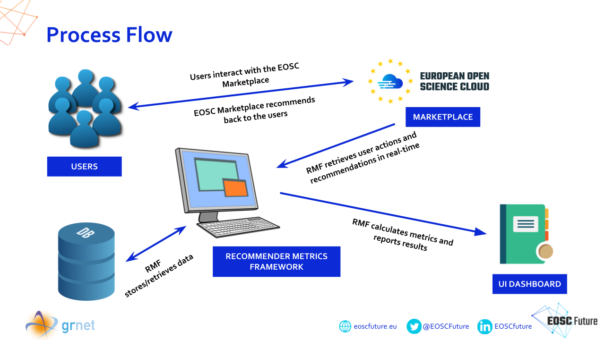

# Licence

<! --- SPDX-License-Identifier: CC-BY-4.0  -- >

## System Architecture

## EOSC Recommender Metrics Framework
The Recommender Metrics Framework (RMF) is an independent "metrics framework as a service" that supports the evaluation and adaptation of recommendation mechanisms. The European Open Science Cloud (EOSC) uses a modern recommender System (RS) in the EOSC Marketplace for suggesting various resources. Using RMF to measure the success of the EOSC RS is crucial to get valuable insights into many aspects that affect the user experience. The use of additional diagnostic metrics and visualizations offers deeper and sometimes surprising insights into a model's performance. The evaluation is quantitatively performed by processing information such as resources, user actions, ratings, and recommendations to measure the impact of the AI-enhanced services and user satisfaction as well as to incorporate this feedback and improve the services provided, via a user-friendly Application Programming Interface (API)  and a User Interface (UI) dashboard. The framework supports real-time ingestion of data, multiple resource types and recommendation systems as sources, while it consists of 3 components. The Preprocessor component is responsible for: data retrieval through a connector module that claims and transforms data from various sources, leveraging item-associated knowledge, dissociated and dummy data removal, relation tags dispatch to information that marks various associations in the data, i.e. registered or anonymous-related users and services, statistics' information provision. Moreover, this component is able to run in batch mode for gathering data from the various sources offline, and in stream mode where agents gather the various data from the respective sources in real-time. The RSmetrics component is responsible for processing the collected data, computing the designated evaluation metrics, and producing the necessary information in a homogenized manner. The third component is a RESTful API along with a rich UI dashboard presenting reports as a web service and visualizing metrics and statistics. The implementation features simple statistics and complex metrics. Several statistics that are served are the number of registered and anonymous users or items to the system, how many user actions or recommendations have been performed. Concerning the metrics, it delivers the: Catalogue and User Coverage, Diversity based on the Gini Index and the Shannon Entropy, Novelty, Accuracy, and a list of  Key Performance Indicators (KPI)s indicating measurable values that demonstrate how effectively key business objectives are achieved. Concerning the latter case, the KPIs metrics are: Click-Through Rate, Hit Rate, Top-5 viewed items and recommended Services, Top-5 categories and scientific domains for both orders and recommendations. The software not only delivers the results through the data REST API and the UI dashboard, but it additionally exposes graphic visualizations of statistics such as User Actions and Recommended Items per Day and Month. The RS evaluation framework is constantly expanding with new features, metrics, and utilities, to lead to more robust, data-adaptable, and good-quality RS designs. In this demo we are going to present the way the different components work, the integration with other EOSC Components, a typical process flow, and an overview of the statistics, the metrics, the KPIs, and the graphs produced after the computations.

## Components Functionality

### Preprocessor
This module is responsible for:
* data retrieval through a connector module that claims and transforms data from various sources
* service-associated knowledge correlations
* dummy or dissociated data removal
* tagging of various associations in the data, i.e. registered or anonymous -related users and services
* generation of statistics information. 

### RS Metrics
This module is responsible for:
* processing the data
* computing the designated evaluation metrics
* producing the necessary information in a homogenized manner.

